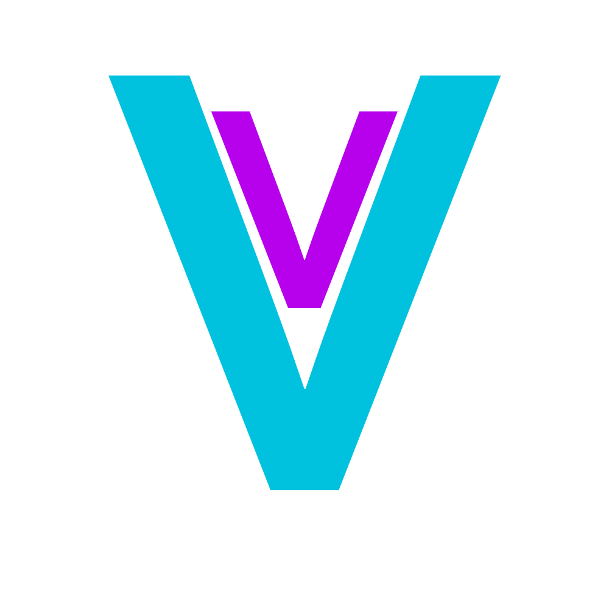

# VeritasDB: A Simple, Open-Source CSV Database

VeritasDB is a project under development that aims to provide a user-friendly, open-source database solution for storing and managing data in CSV format.

## Features:
- **Create tables**: Organize your data in custom structures.
- **Query data**: Access and retrieve specific information quickly and efficiently.
- **Manipulate data**: Edit, delete, and update your data with simple commands.

## Future Plans:
- **CSV export**: Share your data easily with other systems and tools.
- **Advanced features**: Implement additional data management features, such as filtering, sorting, and grouping.
- **Continuous development**: Improve the platform based on community feedback and user needs.

## Contribute to VeritasDB:
Join the VeritasDB community and help build a comprehensive and accessible open-source database!
