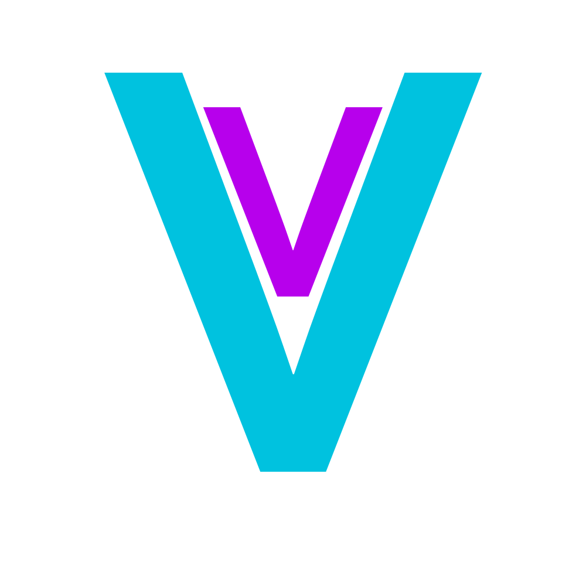

# VeritasDB: Um Banco de Dados CSV Simples e Open-Source

VeritasDB é um projeto em desenvolvimento que visa fornecer uma solução de banco de dados amigável e de código aberto para armazenar e gerenciar dados no formato CSV.

## Funcionalidades:
- Crie tabelas: Organize seus dados em estruturas personalizadas.
- Consulte dados: Acesse e recupere informações específicas de forma rápida e eficiente.
- Manipule dados: Edite, exclua e atualize seus dados com comandos simples.

## Planos Futuros:
- Exportação em CSV: Compartilhe seus dados facilmente com outros sistemas e ferramentas.
- Funcionalidades avançadas: Implemente recursos adicionais de gerenciamento de dados, como filtragem, ordenação e agrupamento.
- Desenvolvimento contínuo: Aprimore a plataforma com base no feedback da comunidade e nas necessidades dos usuários.

## Contribua para o VeritasDB:
Junte-se à comunidade VeritasDB e ajude a construir um banco de dados abrangente e acessível de código aberto!
